# jt-glogi18n — Graylog Web UI 本地化套件（繁體中文 / 日本語）  `v3.2.0`

透過 Nginx `sub_filter` 在 HTTP 回應的 `</head>` 前注入翻譯腳本與 CSS，
將 Graylog Web UI 介面在瀏覽器端翻譯為 **繁體中文 （zh-TW）** 或
**日本語 （ja）**。**不修改 Graylog 本體**、**不需要瀏覽器擴充**。

> [英文版說明](README.md)

## 實際畫面

### 多語系即時切換 — English / 繁體中文 / 日本語

每一頁右下角都有語系切換懸浮按鈕，**每位使用者**可即時切換語系、不需重新整理
Graylog。首次載入會依 `navigator.languages` 自動挑選（`zh-Hant` → 繁中、
`ja*` → 日文、其他保留英文），選擇會記錄在 `localStorage`。

| | |
|---|---|
| **搜尋頁的語系切換懸浮按鈕**（右下角） | **日本語介面 — 看板小工具** |
| 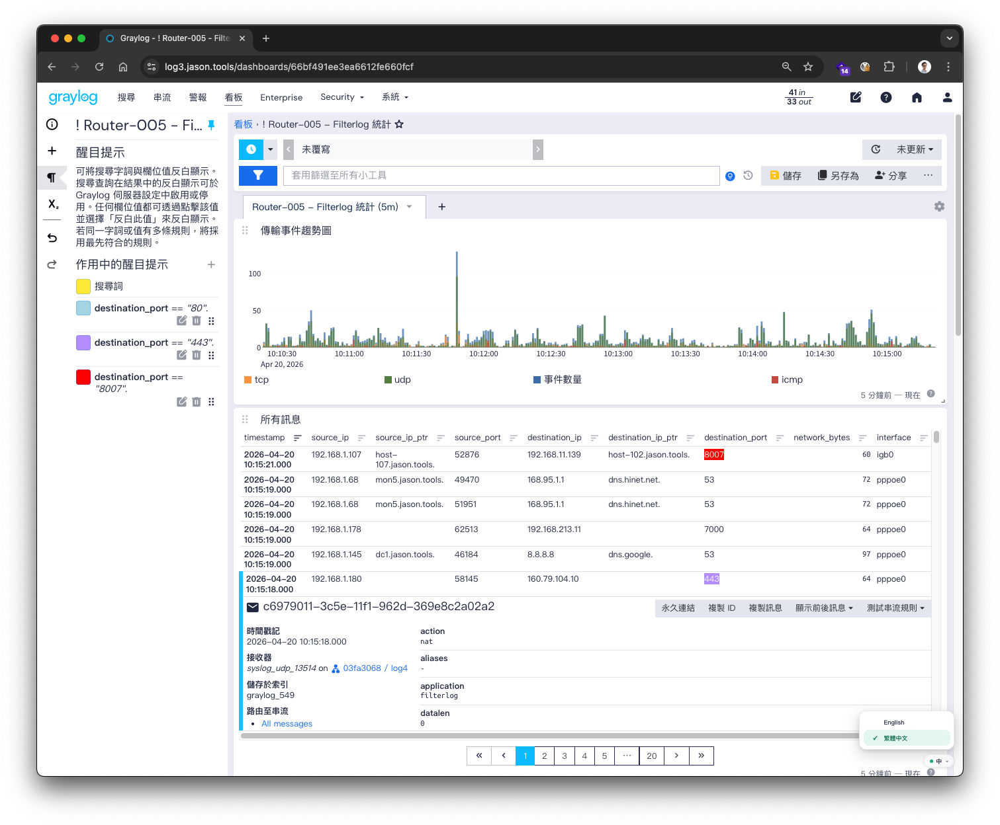 | 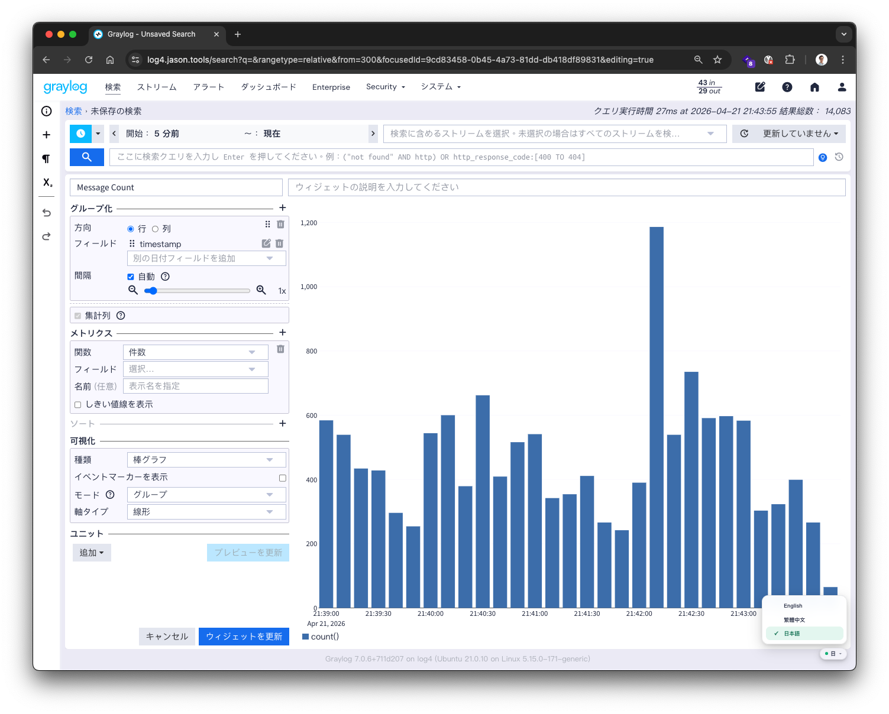 |
| **日本語介面 — 管線規則編輯器** | **繁體中文介面 — 同一頁的中文呈現** |
| 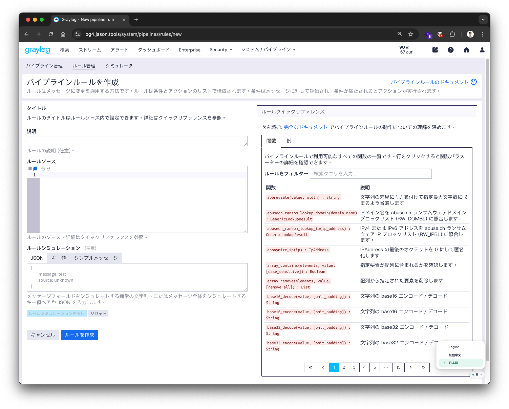 | 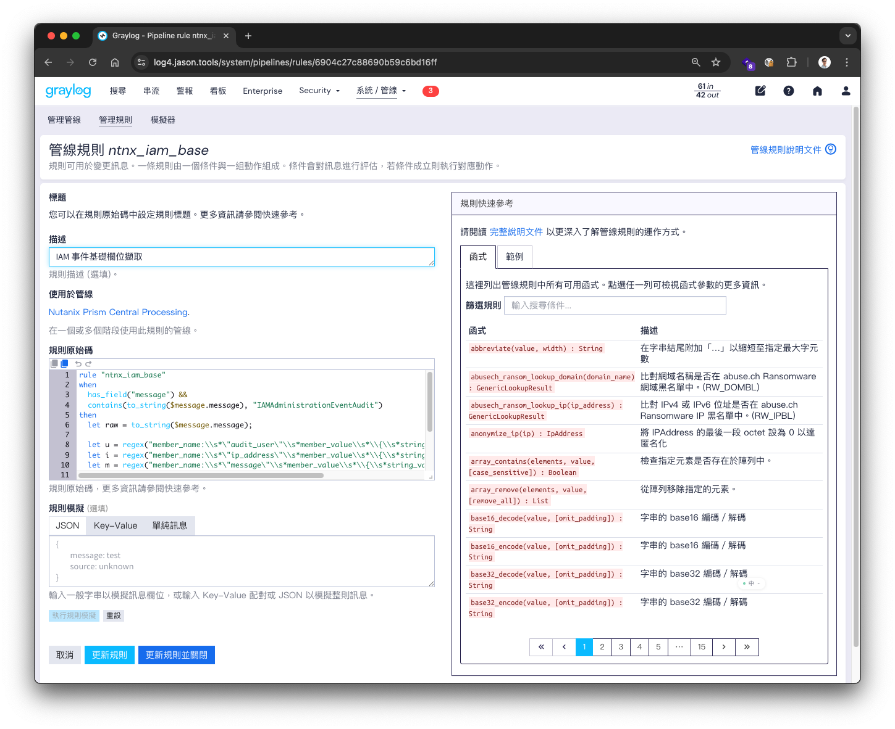 |

### 其他頁面

| | |
|---|---|
| **認證服務設定頁** | **管線列表與規則** |
| 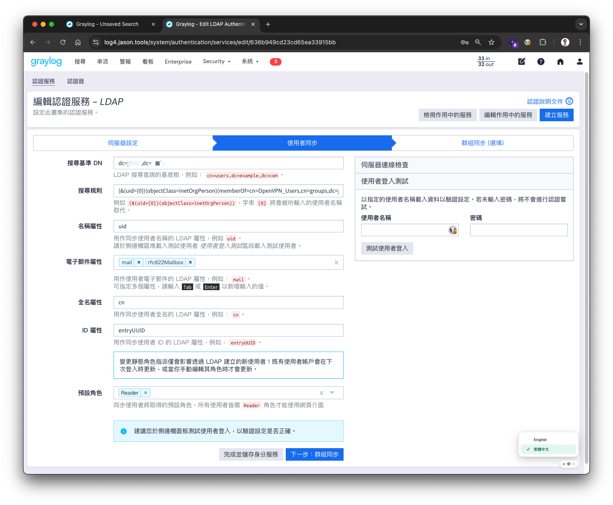 | 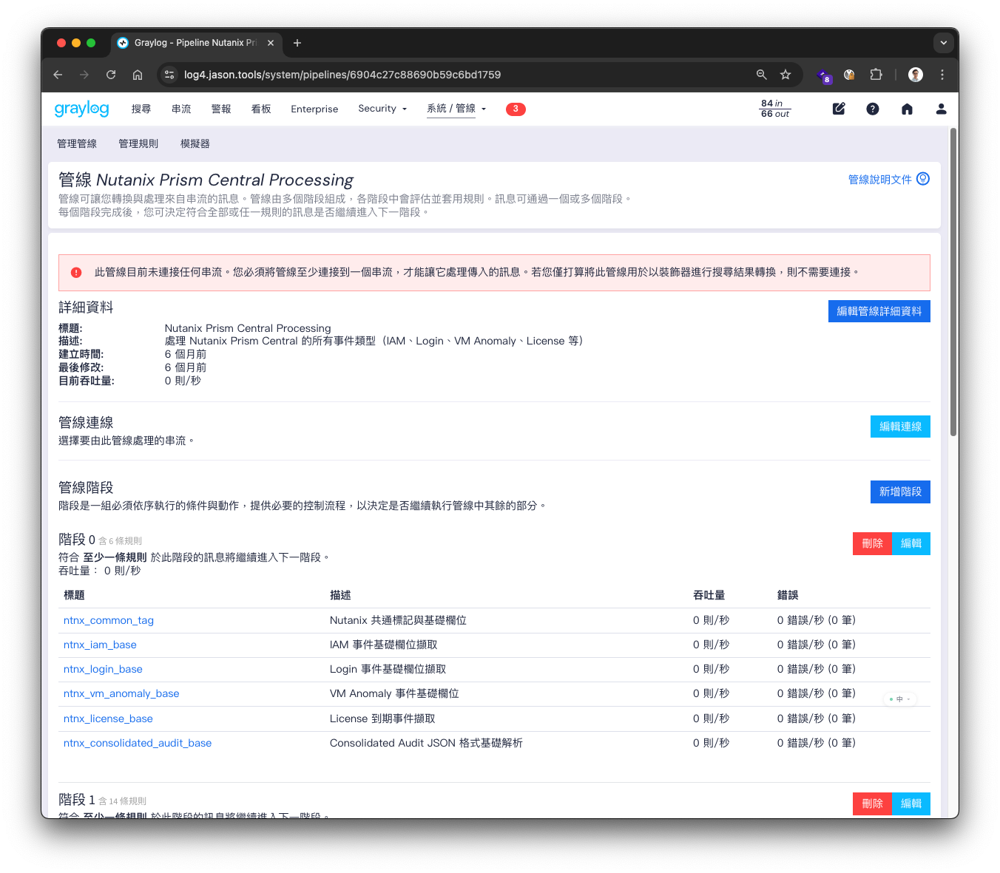 |
| **事件定義設定** | **輸入器編輯畫面** |
| 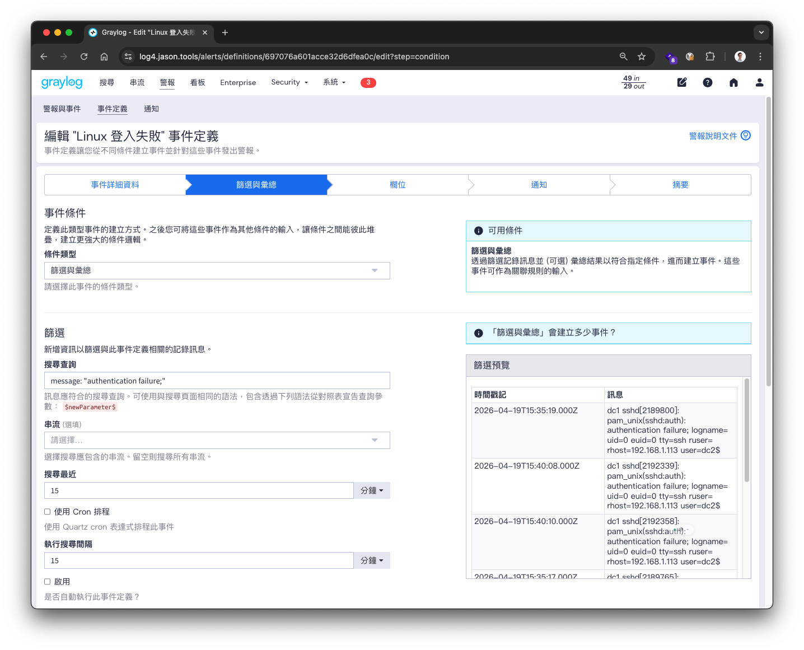 | 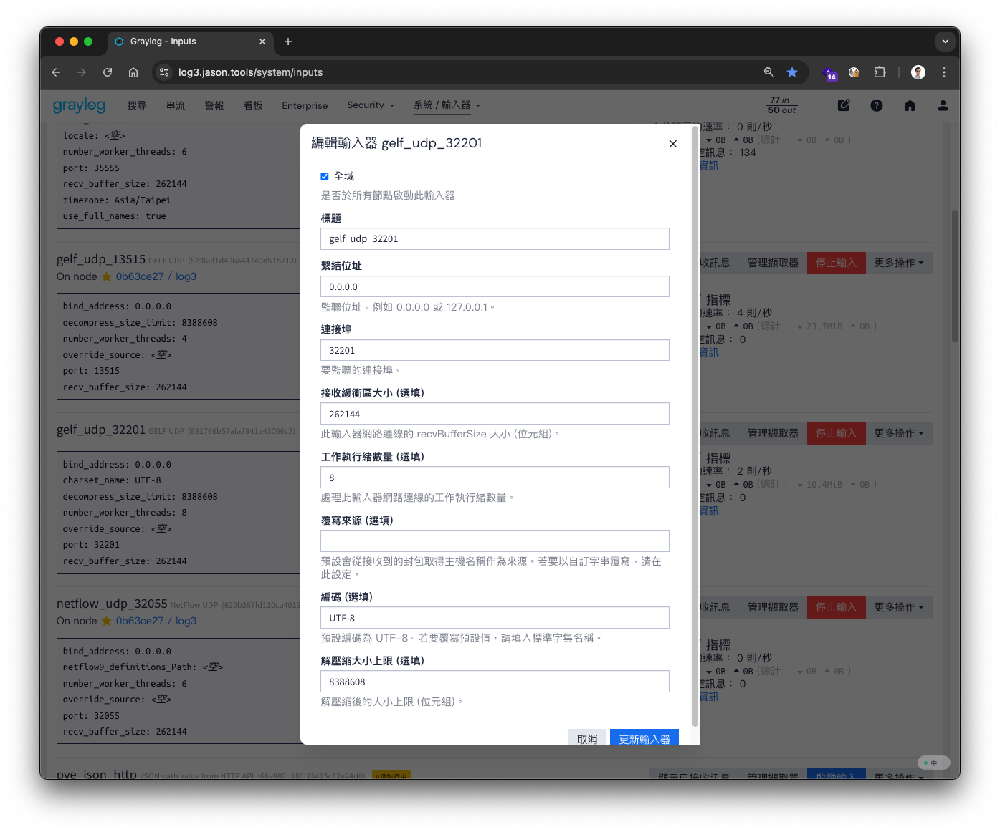 |
| **輸入器擷取器清單** | **對照表建立精靈** |
| 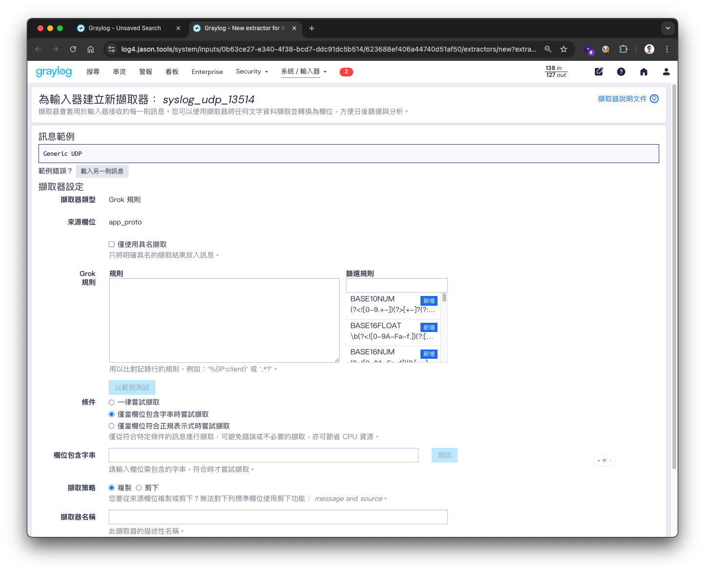 | 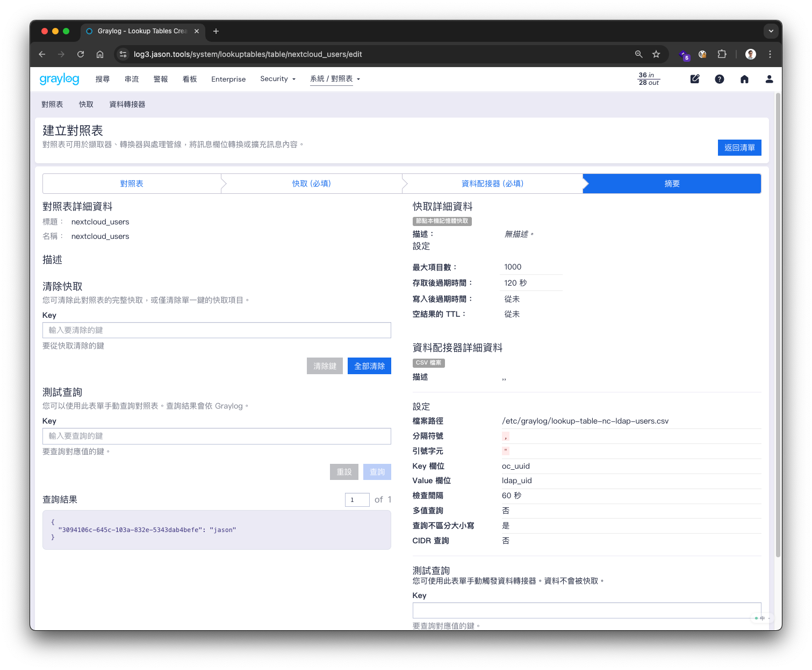 |
| **看板小工具的時間範圍選擇器** | |
| 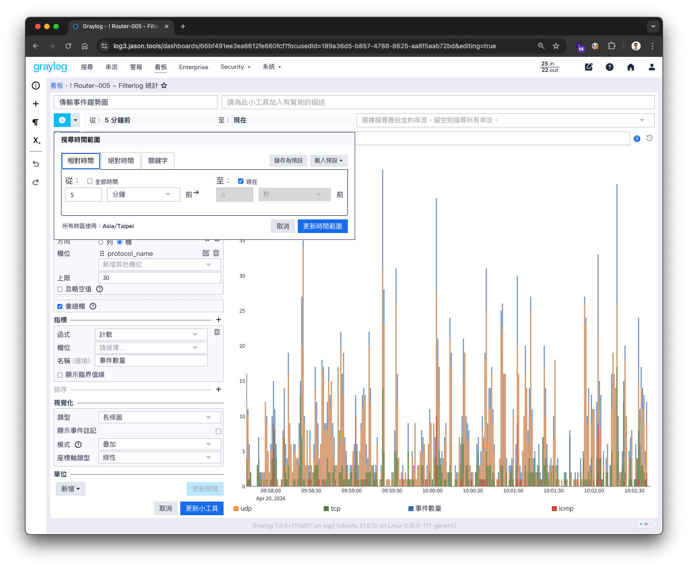 | |

- 適用 Graylog：**6.0 / 6.1 / 6.2 / 6.3 / 7.0**（實測 6.3.9 與 7.0.6）
- 機制：Nginx 反向代理 + `sub_filter` 注入 + 瀏覽器端 DOM 翻譯
- 內建語系切換：畫面右下角懸浮按鈕可即時切換「English / 繁體中文 / 日本語」。首次載入會依 `navigator.languages` 自動挑選（`zh-Hant` → 繁中、`ja*` → 日文、其他保留英文），之後以使用者手動切換為準。
- 涵蓋範圍（字典 2.9.2 / ja 0.4.1）：**4,987 條字面翻譯** + **576 條 regex pattern**，繁中為主、日文與繁中逐條 1:1 對應（任何 key 兩種語系皆存在）。覆蓋完整 Graylog Open UI 加上大部分 Enterprise toast 訊息、pipeline 函數、rule builder、擷取器 / 轉換器表單（AMQP / Kafka / AWS Kinesis / Syslog / JSON path HTTP）、索引集管理、資料節點遷移、憑證機構建置、輸入器設定精靈、Input Diagnosis 面板、Change Field Type / Set Profile modal、email 通知表單、使用者搜尋語法、鍵盤快速鍵對話框、伺服器無法連線對話框、系統記錄 pattern 等

### 日文翻譯說明

作者**不懂日文**。日文字典由 LLM 大語言模型協助翻譯，並根據日文使用者提供的
風格指南持續修訂。現行術語慣例：

- 產品名詞：**入力**（Input）/ **出力**（Output）/ **エクストラクター**（Extractor）/ **ストリーム**（Stream）/ **パイプライン**（Pipeline）/ **インデックスセット**（Index Set）/ **ダッシュボード**（Dashboard）/ **ウィジェット**（Widget）/ **通知**（Notification）/ **イベント定義**（Event definition）/ **認証サービス**（Authentication service）
- UI 標籤採簡潔名詞形；操作提示用 `〜してください`。
- 避免英文直譯（如 `空の場合` → `未選択の場合`、`役立つ説明` → `説明`、`ロールアップ列` → `集計列`）。
- 時間範圍標籤優先使用 `期間` 而非 `時間範囲`。
- 片假名一律加長音（`サーバー`、`ユーザー`、`コレクター`、`フィルター`），`クラスタ` 除外（依專案慣例）。

歡迎指教 — 若發現翻譯不自然，請直接在 GitHub 開 issue，附上字串與建議譯文。
詳見[回報指南](CONTRIBUTING_zh-tw.md)。

## 快速安裝

從 GitHub 取得（或更新）原始碼後執行安裝腳本（以 `bash` 啟動，不依賴 `git clone` 後的執行權限位）：

```bash
# 第一次執行會 clone;已存在則 fast-forward pull —— 一定拿到最新版
git clone https://github.com/jasoncheng7115/jt-glogi18n.git 2>/dev/null \
  || git -C jt-glogi18n pull --ff-only
cd jt-glogi18n
sudo bash install.sh
```

同樣這三行，在同一台主機上重跑就是「升級」流程 —— 不會誤裝到上次留在本機的舊版。

安裝腳本會自動偵測環境並選擇正確模式：

| 情境 | 腳本行為 |
|---|---|
| 未安裝 nginx | 詢問後用 `apt` / `dnf` / `yum` 自動安裝 |
| 有 nginx、尚未反向代理 Graylog | 自動寫入 `/etc/nginx/conf.d/graylog-i18n.conf` |
| 有 nginx、已反向代理 Graylog | **不動**你現有設定；產生 snippet，提示手動 `include` |

非互動模式（自動化 / CI）：

```bash
sudo ASSUME_YES=1 \
     DOMAIN=graylog.example.com \
     BACKEND=127.0.0.1:9000 \
     SSL_CRT=/etc/ssl/certs/graylog.crt \
     SSL_KEY=/etc/ssl/private/graylog.key \
     ./install.sh
```

亦可等效使用 CLI 旗標：

```bash
sudo ./install.sh -y \
     --domain=graylog.example.com \
     --backend=127.0.0.1:9000 \
     --ssl-crt=/etc/ssl/certs/graylog.crt \
     --ssl-key=/etc/ssl/private/graylog.key
```

其他旗標：`-v/--verbose`、`-n/--dry-run`（只印出動作、不改任何檔案）、
`--no-color`、`--open-firewall=yes|no`（預設 `ask`）。

### Snippet 模式（已有反向代理時）

若您已用 Nginx 反向代理 Graylog，腳本**不會**動您的 server block。它只會：

1. 把靜態資源部署到 `/opt/jt-glogi18n/static/`
2. 寫一個 snippet 到 `/etc/nginx/snippets/graylog-i18n.conf`
3. 印出兩個需要您手動處理的步驟：
   - 在您既有的 Graylog `location / { ... }` 區塊內加上
     `include /etc/nginx/snippets/graylog-i18n.conf;`
   - 另外補一個靜態資源 location：
     ```nginx
     location /graylog-i18n/ {
         alias /opt/jt-glogi18n/static/;
         expires 1h;
         add_header Cache-Control "public, must-revalidate";
     }
     ```
4. 最後 reload：`sudo nginx -t && sudo systemctl reload nginx`

完整的 server block 範本可參考 `nginx/graylog-i18n.conf`。

## 日常指令

```bash
sudo ./install.sh              # 安裝(互動式)
sudo ./install.sh update       # 只更新字典 / JS / CSS(不動 nginx)← 日常升級用
sudo ./install.sh uninstall    # 移除(會逐項詢問)
sudo ./install.sh rollback     # 還原到上一份 nginx.conf 備份
     ./install.sh status       # 顯示安裝狀態、字典版本(nginx -t 需 root)
     ./install.sh doctor       # 完整環境診斷 — 新主機建議先跑這個
     ./install.sh help         # 顯示使用說明
```

升級字典只需 `update`；**不需要 reload nginx**。
請提醒使用者以 Cmd+Shift+R / Ctrl+Shift+R 強制重整以避開 1 小時快取。

`doctor` 是上線前最快檢查環境的方式：它會回報 OS、init 系統、Nginx flavor、
`http_sub_module` 是否可用、SELinux 狀態、防火牆狀態、80/443 埠是否被占、
backend 是否可達、是否偵測到既有反向代理等。

## 前置需求

- Graylog 已於 `127.0.0.1:9000`（或 `BACKEND` 指定位置）正常運作
- Nginx 已啟用 `http_sub_module` — 可以是編譯內建（nginx.org 官方、
  Debian `nginx-full` / `nginx-extras`、RHEL 系列皆是），也可以是 dynamic
  module（`/usr/share/nginx/modules/ngx_http_sub_filter_module.so`，部分
  Debian/Ubuntu 發行版）。腳本兩種都能偵測。
- 安裝 / 更新 / 移除 / rollback 需 root 權限
- 若希望腳本自動安裝 nginx，需有 `apt-get` / `dnf` / `yum` / `zypper` /
  `apk` / `pacman` 其中之一
- 選用：SELinux Enforcing 的 RHEL 系列主機建議先裝
  `policycoreutils-python-utils`，讓腳本可用 `semanage fcontext` 套用
  持久化的 `httpd_sys_content_t` 標籤（缺此套件時會退回用 `chcon`，
  但 relabel 後會掉）

## 檔案結構

```
jt-glogi18n/
├── install.sh                          # 安裝 / 更新 / 移除腳本
├── nginx/graylog-i18n.conf             # 參考用的 server block 範本
├── static/
│   ├── graylog-i18n-zh-tw.js           # 翻譯引擎 + 語系切換懸浮按鈕
│   ├── graylog-i18n-dict.json          # 繁中字典（新增翻譯優先改這個）
│   ├── graylog-i18n-ja.json            # 日文字典（與繁中 1:1 對應）
│   ├── graylog-i18n-locales.json       # 可用語系清單（en / zh-TW / ja）
│   └── graylog-i18n-patch.css          # 字型與排版修正
└── tools/extract-strings.sh            # 從 graylog.jar 擷取候選字串的輔助工具
```

## 翻譯機制簡述

1. Nginx 把 `</head>` 替換為 `<link>` + `<script>` 指向 `/graylog-i18n/*`
2. JS 依目前選定語系載入字典（繁中 `graylog-i18n-dict.json` 或日文 `graylog-i18n-ja.json`），走訪所有 text node：先精確比對 → 再跑正規式
3. `MutationObserver` 監聽 SPA 動態 DOM，隨時翻譯新產生的節點
4. 記錄內容、欄位名、識別碼、JSON payload、程式碼、搜尋輸入、Material icon 容器（`material-symbols*` / `material-icons*`，字面就是 glyph）等皆透過兩層 skip list **排除**。`HARD_SKIP_SELECTORS` 優先於 `FORCE_TRANSLATE_SELECTORS`，確保 Mantine 按鈕中的 icon glyph 不會被強制翻譯影響。

## 偵錯模式

瀏覽器 Console：

```javascript
localStorage.setItem('graylog-i18n-debug', 'true');
location.reload();

window.__graylogI18n.stats();        // 統計
window.__graylogI18n.retranslate();  // 手動重新翻譯整頁
window.__graylogI18n.translations;   // 字典
window.__graylogI18n.patterns;       // pattern 列表
```

## 常見問題

| 症狀 | 可能原因 | 解法 |
|---|---|---|
| 修改字典但前端沒變 | Nginx 1h 快取 / 瀏覽器快取 | Cmd+Shift+R 強制重整 |
| 腳本沒注入 | 後端回 gzip 壓縮 | 檢查 `proxy_set_header Accept-Encoding "";` |
| 腳本 401 / 被 CSP 擋 | 沒覆蓋 Graylog CSP | 檢查 `proxy_hide_header Content-Security-Policy` 與新 `add_header` |
| 安裝程式中斷，提示「nginx -t 已失敗」 | 既有 `nginx.conf` 有問題（未定義的 `log_format`、遺失的 `include` 等） | 先修好既有設定再重跑安裝 |
| RHEL / Rocky 上 `/graylog-i18n/*` 回 403 | SELinux 擋讀檔 | `getenforce`；若 Enforcing：`sudo restorecon -Rv /opt/jt-glogi18n/`。若主機有 `policycoreutils-python-utils`，安裝程式會自動處理 |
| 瀏覽器連不到 | firewalld / ufw / nftables 擋掉 80/443 | 用 `--open-firewall=yes` 重跑，或手動加規則 |
| 安裝程式說 `http_sub_module: NO` | Nginx 套件不對 | Debian：`nginx-full` 或 `nginx-extras`；RHEL：改用 nginx.org 官方 repo |
| `502 Bad Gateway` | backend（`$BACKEND`）沒在聽 | `./install.sh doctor` 會測 backend 可達性 |
| 跑完安裝但 UI 還是英文 | 我們設定檔的 `server_name` 跟您訪問的網址不一致 | 檢查 `/etc/nginx/conf.d/graylog-i18n.conf`，`server_name` 必須與瀏覽器訪問的 host 相符 |
| 特定字串未翻譯 | 不在字典 / 文字被拆成多個 text node | 加入字典（必要時拆成多個 fragment） |
| Log 內容被誤譯 | skip list 漏洞 | 於 JS 的 `SKIP_SELECTORS` 新增對應選擇器 |

## 緊急修復 — 當 nginx 安裝後壞掉

如果跑完安裝程式後 nginx 整個壞掉(`nginx -t` 失敗、`systemctl start
nginx` 起不來、dpkg post-install hook 一直噴錯),最常見的根因是
`/etc/nginx/nginx.conf` 被人手動刪掉,然後 dpkg 把它記成「使用者
已刪除的 conffile」就再也不會自動補回來。典型錯誤:

```
nginx: [emerg] open() "/etc/nginx/nginx.conf" failed (2: No such file or directory)
```

Debian / Ubuntu 復原五步驟:

```bash
# 1. 先看 /etc/nginx 現狀
ls -la /etc/nginx/

# 2. 確認 dpkg 是否仍把 nginx.conf 視為 conffile
dpkg-query -W -f='${Conffiles}\n' nginx-common | grep nginx.conf

# 3. 強制重新部署 nginx-common 提供的預設 conffile
sudo apt-get install --reinstall \
    -o Dpkg::Options::="--force-confmiss" nginx-common

# 4. 把卡住的套件設定完成
sudo dpkg --configure -a
sudo apt-get install -f

# 5. 驗證 + 啟動
sudo nginx -t
sudo systemctl restart nginx
sudo systemctl status nginx
```

nginx 恢復正常後,再重跑 jt-glogi18n 安裝:

```bash
cd ~/jt-glogi18n
git pull --ff-only
sudo bash install.sh
```

安裝程式的 pre-flight 會先驗證剛還原的 `nginx.conf`,寫入失敗時的
rollback 也會自動還原 `/etc/nginx/conf.d/graylog-i18n.conf` 的上一份
備份。

## 移除

```bash
sudo ./install.sh uninstall
```

會移除 `/opt/jt-glogi18n/`、`/etc/nginx/conf.d/graylog-i18n.conf` 及 snippet
檔。**僅在 `nginx -t` 通過時才會 reload nginx** — 若測試失敗，腳本會印出
警告並保持 nginx 現狀，交給您手動檢查。若使用 snippet 模式，請先從既有
server block 移除 `include` 行再 uninstall，否則 `nginx -t` 會因為懸空的
`include` 而失敗。

## 搭配專案：jt-glogarch

想要更完整的繁體中文 Graylog 環境？建議將本專案與
**[jt-glogarch](../jt-glogarch/)** 搭配使用 — 我們的
Graylog Open 記錄封存 / 還原工具。jt-glogarch 提供長期記錄封存、
磁碟完整性驗證、一鍵還原回 Graylog，並附帶自己的繁中 Web UI。
兩者搭配可讓 Graylog Open 部署擁有兩個原本只有 Enterprise 才有的
能力：**繁中 / 日文介面**（本專案）與**合規記錄封存**（jt-glogarch）。

## 授權

本專案以 **Apache License 2.0** 授權發佈，詳見 [LICENSE](LICENSE)。

Copyright (c) Jason Cheng（[Jason Tools](https://jason.tools)）。

原始碼倉庫：<https://github.com/jasoncheng7115/jt-glogi18n>，歷程見[版本紀錄](CHANGELOG_zh-tw.md)。
